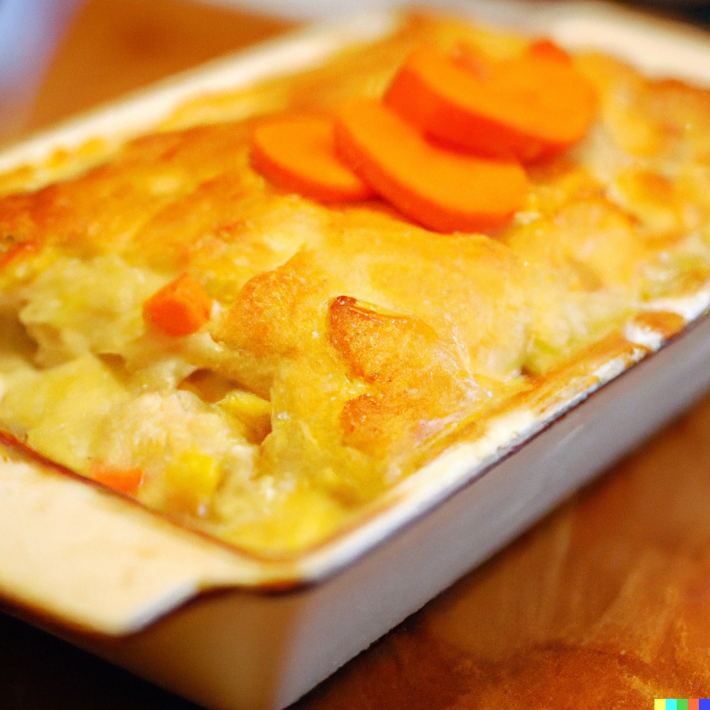

Cornish Fish Pie is a classic dish that is beloved by locals and visitors alike. This hearty and comforting meal is made with a variety of fresh fish and topped with a creamy layer of mashed potatoes, making it the perfect comfort food for any occasion.

In this recipe, I showcase the incredible flavors of Cornish seafood by using a combination of white fish, smoked haddock, and prawns. These ingredients are cooked in a savory and aromatic mixture of onions, garlic, and herbs, giving the dish a depth of flavor that is both satisfying and delicious.

The mashed potato topping is the perfect finishing touch, providing a creamy and indulgent layer that complements the fish perfectly. Whether you're looking for a cozy family meal or a special dish to serve to guests, Cornish Fish Pie is sure to be a hit.

This recipe is easy to customize to your personal tastes, so feel free to experiment with different types of fish or add in extra veggies for a healthy twist. With just a few simple ingredients and a bit of preparation time, you can create a dish that is both comforting and delicious, and truly captures the essence of Cornish cuisine.

# Ingredients

* 600g mixed fish (such as haddock, cod, salmon and prawns)
* 600ml milk
* 50g butter
* 50g plain flour
* 1 onion, chopped
* 1 carrot, diced
* 1 celery stick, chopped
* 2 garlic cloves, minced
* 2 tbsp chopped parsley
* Salt and black pepper
* 900g potatoes, peeled and chopped
* 50g grated cheddar cheese

# Instructions

Preheat the oven to 200°C.

Place the fish in a large ovenproof dish.

In a saucepan, melt the butter over medium heat.

Add the flour and whisk until smooth.

Gradually add the milk, whisking constantly, until the mixture thickens.

Add the onion, carrot, celery, garlic and parsley to the saucepan, and cook for 5 minutes.

Season with salt and black pepper to taste.

Pour the sauce over the fish in the ovenproof dish.

Boil the potatoes in a separate pan until tender.

Mash the potatoes with a little butter, salt and black pepper.

Spread the mashed potatoes over the top of the fish and sauce.

Sprinkle grated cheese over the top.

Bake in the preheated oven for 30-40 minutes, or until golden brown and bubbling.