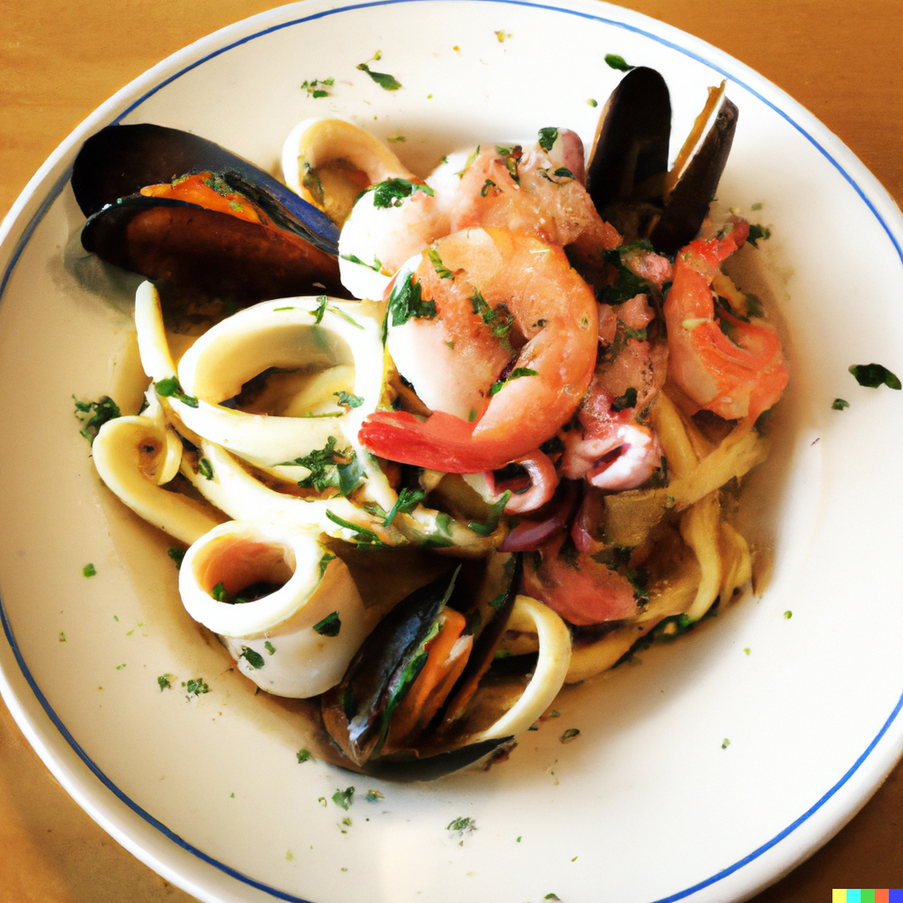

Cornish seafood is some of the freshest and most delicious in the world, and my Cornish seafood linguine recipe is the perfect way to showcase its incredible flavor. This dish is packed with a variety of succulent seafood, including mussels, prawns, and squid, and is served over a bed of al dente linguine pasta.

The combination of fresh seafood with the rich flavors of garlic, white wine, and butter creates a dish that is both luxurious and satisfying. The linguine pasta provides the perfect vehicle for soaking up all the delicious flavors of the dish, making it an ideal meal for any seafood lover.

This recipe is incredibly versatile and can be easily adapted to include your favorite seafood ingredients. It's also perfect for serving to a crowd, as it can be prepared in large quantities and served family-style.

With its bold and delicious flavors and easy preparation, my Cornish seafood linguine recipe is sure to become a go-to dish in your kitchen. So why not give it a try and experience the incredible taste of fresh Cornish seafood?

# Ingredients 

* 500g linguine
* 300g cooked crab meat
* 2 garlic cloves, minced
* 1 red chilli, finely chopped
* 4 tbsp olive oil
* 1 lemon, juiced and zested
* Salt and black pepper
* 2 tbsp chopped parsley

# Instructions

Cook the linguine according to the package instructions.

In a frying pan, heat the olive oil over medium heat.

Add the garlic and chilli, and cook for 1-2 minutes.

Add the crab meat and lemon zest, and cook for 2-3 minutes.

Season with salt and black pepper to taste.

Add the cooked linguine to the frying pan, and toss until well coated in the crab sauce.

Drizzle with lemon juice and sprinkle with chopped parsley.

Serve hot.