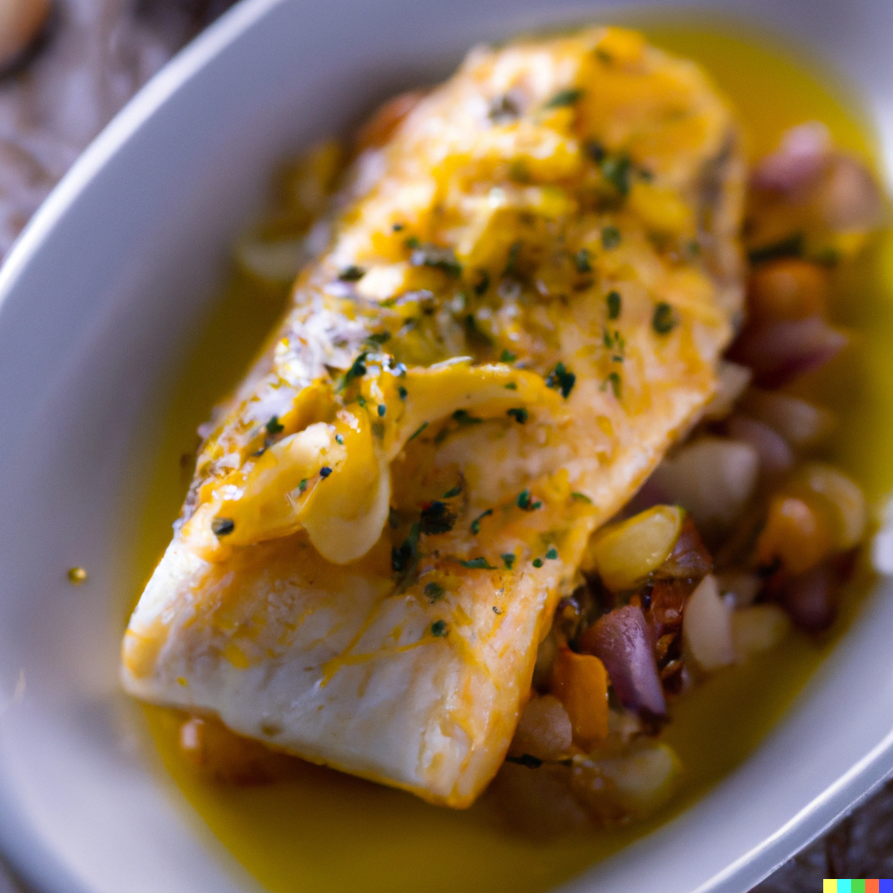

# Hake Fillet with Saffron and Garlic Sauce

# Ingredience

* 4 hake fillets
* Salt and black pepper
* 2 tbsp olive oil
* 1 onion, finely chopped
* 2 garlic cloves, minced
* 1 tsp saffron threads
* 150ml dry white wine
* 150ml fish stock
* 100ml double cream
* 2 tbsp chopped parsley

# Instructions

Preheat the oven to 200°C.

Season the hake fillets with salt and black pepper, and brush with olive oil.

Place the fillets in a baking dish, and bake in the preheated oven for 10-15 minutes, or until cooked through.

While the hake is baking, prepare the sauce.

In a frying pan, heat the olive oil over medium heat.

Add the onion and garlic, and cook for 2-3 minutes, or until softened.

Add the saffron threads and cook for a further minute.

Add the white wine and fish stock, and bring to the boil.

Reduce the heat and simmer for 10-15 minutes, or until the sauce has reduced by half.

Add the double cream and stir to combine.

Season with salt and black pepper to taste.

Serve the baked hake fillets hot, with the saffron and garlic sauce poured over the top. Sprinkle with chopped parsley to garnish.