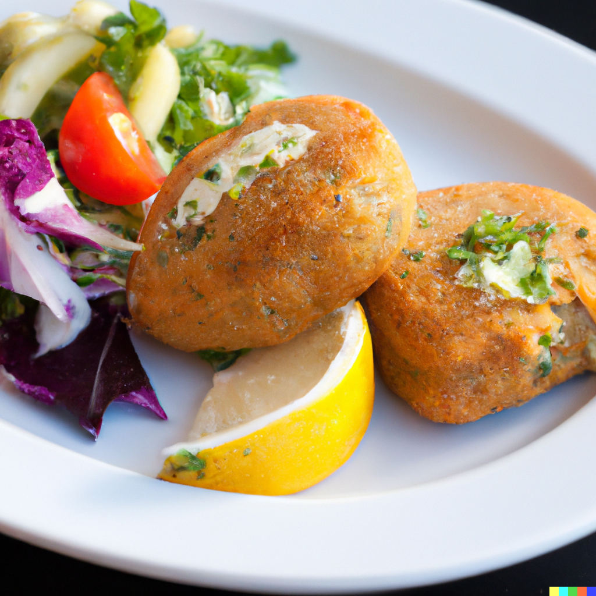

Cornish cuisine is known for its fresh seafood dishes that are packed with flavor, and my Cornish crab cake recipe is no exception. The delicious combination of sweet, succulent crab meat with a hint of spice and a crunchy exterior makes this dish a must-try for seafood lovers.

Cornwall's coastline provides the perfect setting for crab fishing, and many local fishermen have been perfecting their crabbing techniques for generations. The use of locally caught crab in this recipe is not only delicious, but it also supports sustainable fishing practices and the local economy.

These crab cakes are easy to prepare and make for a fantastic starter or main course when served with a fresh salad or creamy dipping sauce. Whether you're hosting a dinner party or simply looking for a tasty weeknight meal, these Cornish crab cakes are sure to be a hit.

## Ingredients

* 500g cooked crab meat
* 1 red onion, finely chopped
* 1 red chilli, finely chopped
* 2 garlic cloves, minced
* 2 tbsp chopped coriander
* 2 eggs, beaten
* 100g breadcrumbs
* Salt and black pepper
* 2 tbsp olive oil

## Method

In a large bowl, mix together the crab meat, red onion, chilli, garlic and coriander.

Add the beaten eggs and breadcrumbs, and mix until well combined.

Season with salt and black pepper to taste.

Shape the mixture into small patties.

Heat the olive oil in a frying pan over medium-high heat.

Cook the crab cakes for 3-4 minutes on each side, or until golden brown and crispy.

Serve hot with a side salad.

* Serves: 5
* Preparation time: 30 mins