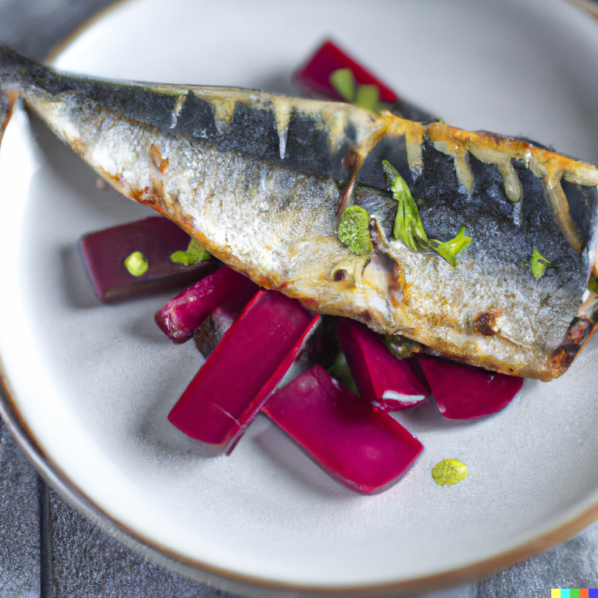

Cornish mackerel is a versatile fish that is abundant along the coast of Cornwall. Its rich, oily flesh makes it an ideal candidate for grilling, and it pairs perfectly with a variety of vibrant and flavorful ingredients.

My recipe for Cornish Mackerel with Beetroot and Horseradish Relish showcases the bold flavors of this fish, combining it with the tangy sweetness of cooked beetroot and the sharp heat of horseradish. These flavors are brought together in a relish that provides a perfect complement to the delicate and flaky texture of the mackerel.

This dish is not only delicious, but it is also incredibly nutritious, as mackerel is an excellent source of omega-3 fatty acids, which are essential for maintaining good health. With this recipe, you can enjoy the benefits of this superfood while also indulging in a delectable and satisfying meal.

Whether you're a seafood lover or simply looking to explore new flavor combinations, my Cornish Mackerel with Beetroot and Horseradish Relish recipe is sure to impress.

## Ingredients

* 4 Cornish mackerel fillets
* Salt and black pepper
* 2 tbsp olive oil
* 2 medium-sized beetroot, cooked and peeled
* 2 tbsp grated horseradish
* 1 tbsp white wine vinegar
* 1 tsp honey
* 1 tbsp chopped parsley

## Method

Preheat the grill to medium-high heat.

Season the mackerel fillets with salt and black pepper, and brush with olive oil.

Grill the mackerel fillets for 3-4 minutes on each side, or until cooked through.

While the mackerel is grilling, prepare the relish.

Grate the cooked beetroot into a mixing bowl.

Add the grated horseradish, white wine vinegar, honey and chopped parsley.

Mix well until all the ingredients are combined.

Serve the grilled mackerel fillets hot with the beetroot and horseradish relish on top. Enjoy!

* Serves 2-4
* Cooking time 40 mins